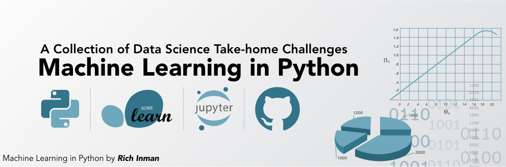

======================
Data Science Notebooks
======================

Table of Contents
-----------------

  * `Description`_
  * `Python Version`_
  * `Dependencies`_
  * `Repo Directory Structure`_

Description
-----------

Back to `Table of Contents`_

Description will go here.

Python Version
--------------

Back to `Table of Contents`_

All of the notebooks in this repository use Python 3.x.

Dependencies
------------

Back to `Table of Contents`_

  * matplotlib
  * numpy
  * pandas
  * pylab
  * scipy
  * seaborn
  * sklearn

Repo Directory Structure
------------------------

Back to `Table of Contents`_

The structure of the directory
::

    ├── LICENCE.txt
    ├── README.rst
    ├── images
    |   ├── 00_Readme_Header.png
    |   └── 01_Customer_Conversion_Rate.png
    └── notebooks
        └── 01 - Customer Conversion Rate.ipynb
